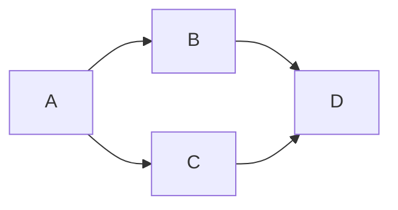

# components

ここではカスタムコンポーネント一覧について説明します。

## conversation

`conversation` は、会話を表現するためのコンポーネントです。

### 基本的な使い方

````markdown-example
```conversation
つまみ: こんにちは！
かさな: こんにちは〜
つまみ: **Markdown 記法**も使えるよ
かさな: *本当ですね*
```
````

### ツッコミを入れる

````markdown-example
```conversation
つまみ: ツッコミを入れてみるぞ！
かさな: どういうこと？  ← 分かってない
かさな: 今の何！？
つまみ: **半角スペース2つ + 左矢印**するとできます！
かさな: なるほどね〜、半角スペース2つ + 左矢印 を本文中に埋め込みたいときはどうするの？
つまみ: `&larr;` とかすればいいんじゃないかな
かさな: 確かに！  &larr;理解しました
```
````

### 複数行書く

`````markdown-example
````conversation
つまみ:: 複数行書いてみよう
かさな::
こうやるのかな？<br>
できてる？
つまみ:: できてます！
かさな:: コロンがない行は前の行の人の発言、ということだね
つまみ:: かしこい、ちなみに大きめの Markdown 記法と組み合わせることもできるぞ
```tsx
function hello(){
  console.log("Hello, world!");
}
```
かさな::
```conversation
かさな: おお〜すごい！発言中にコロンを書きたい場合はどうすれば良い？
つまみ: **使うコロンの数を増やす** (書き方の例を見て) か、`&colon;` と書くといいよ
かさな: Markdown のコードブロックをネストさせる方法みたいだね
```
つまみ:: 一人で会話しないでね
````
`````

## link-embed

`link-embed` は、リンクを埋め込むためのコンポーネントです。

````markdown-example
```link-embed
https://trpfrog.net
```
````

## twitter

react-twitter を使って、ツイートを埋め込むためのコンポーネントです。

````markdown-example
```twitter
1874713171594006580
```
````

## twitter-archived

絶対に消えない偽Twitterです。これでアカウントが凍結されても安心！

### @trpfrog

````markdown-example
```twitter-archived
id: 1874713171594006580
name: つまみ
userid: trpfrog
date: 2025-01-02
tweet: おはようございます
```
````

### その他の人

## ignore-read-count

見た目に変化はありませんが、これで囲った範囲は読了時間計算に使用されなくなります。

`````markdown-example
````ignore-read-count
読了時間に影響を与えない文章

```ts
function hello(){
  console.log("Hello, world!");
}
```

```conversation
つまみ: ちゃんと **Markdown 記法** や *カスタムコンポーネント* も使えるよ
```
````
`````

## centering

中央揃えにするためのコンポーネントです。

````markdown-example
```centering
中央揃え
```
````

## centering-with-size

サイズを指定して中央揃えにするためのコンポーネントです。

````markdown-example
```centering-with-size
3em
デカい
```
````

## centering-with-size-bold

サイズを指定して太字の中央揃えにするためのコンポーネントです。

驚き屋ブログなので、わりと頻繁にデカくて太い文字を使いたくなるのです。

````markdown-example
```centering-with-size-bold
5em
ウワー！
```
````

## mermaid

mermaid を使って図を描くためのコンポーネントです。

````markdown-example

````

## infobox

コラムなどを表示するためのコンポーネントです。

`````markdown-example
````infobox
ここにタイトル

ここにありがたい情報

```conversation
つまみ: ここにはつまみネットの Markdown 記法も使えるよ
かさな: そうなんだ！
```
````
`````

## caution

警告を表示するためのコンポーネントです。

`````markdown-example
````caution
注意！トンビはお前を狙っているぞ

トンビに注意！とかいうやつ、実は注意すればOKという意味ではなくて、**奴らは一瞬で狩りをするので外で食うな**という意味です。
覚えておきましょう。(一敗)
````
`````

## titled-frame

タイトルをつけたフレームを表示するためのコンポーネントです。

`````markdown-example
````titled-frame
タイトル

ここに内容
````
`````

## result-box

(主に徒歩記事で) 結果を表示するためのコンポーネントです。

`````markdown-example
````result-box
歩数: 10000 歩
距離: 5 km
````
`````

## youtube

YouTube の動画を埋め込むためのコンポーネントです。

### ID のみを指定する

`````markdown-example
````youtube
ll8bo-A-_wc
````
`````

### URL を指定する

`````markdown-example
````youtube
https://www.youtube.com/watch?v=qWjgAh21iio
````
`````

## auto-youtube

YouTube の動画を自動再生するためのコンポーネントです。
自動再生は鬱陶しいので基本使わない方が良いです。ここでもコード例を表示するのに留めておきます。

````markdown
```auto-youtube
ll8bo-A-_wc
```
````


## use-effect

useEffect するためのコンポーネントです。ちゃんとクリーンアップ関数も書けるようになっています。以下の例では「アラートを出す」ボタンを押すとアラートが出るようになっています。

<button id="use-effect-button" style="margin-bottom: 1em;">
  アラートを出す (id="use-effect-button")
</button>


`````markdown-example
````use-effect
const handler = () => {
  alert("アラートを出しました");
}

const button = document.getElementById("use-effect-button");
button.addEventListener("click", handler);
return () => {
  button.removeEventListener("click", handler);
}
````
`````

## markdown-example

ちょっとメタ的ですが、このページでしか使っていないコンポーネントとして、Markdown のレンダリングの例を表示するコンポーネントがあります。

```````markdown-example
``````markdown-example
`````markdown-example
````markdown-example
```conversation
つまみ: 見て見て、こんなこともできるよ
かさな: そうなんだ……
```
````
`````
``````
```````
