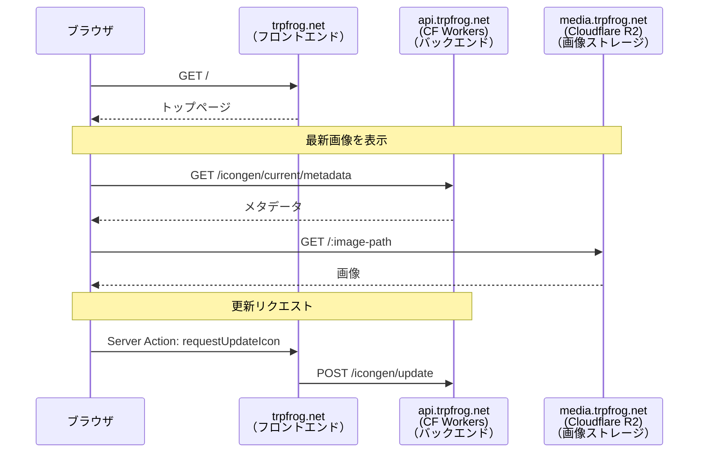
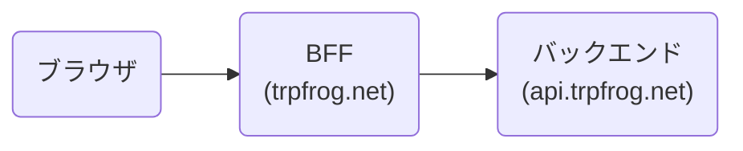
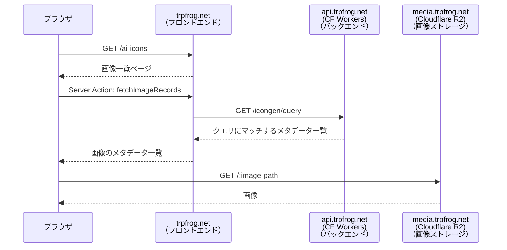
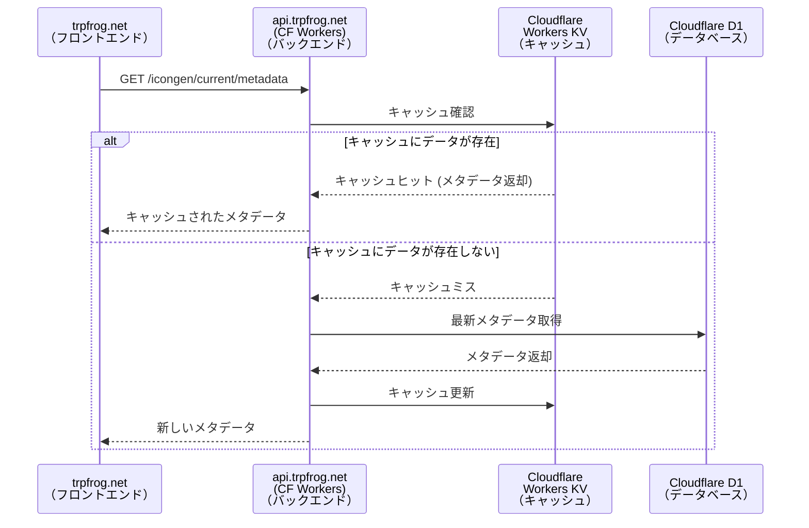
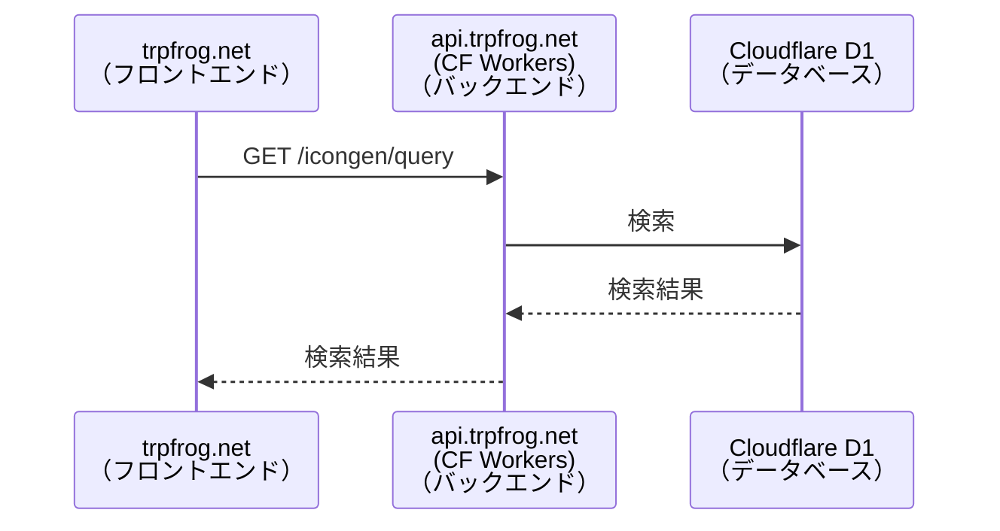
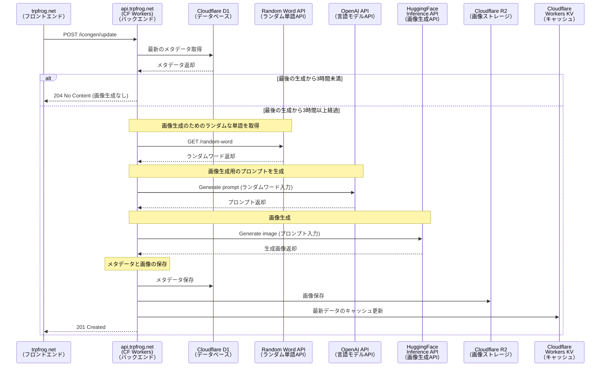
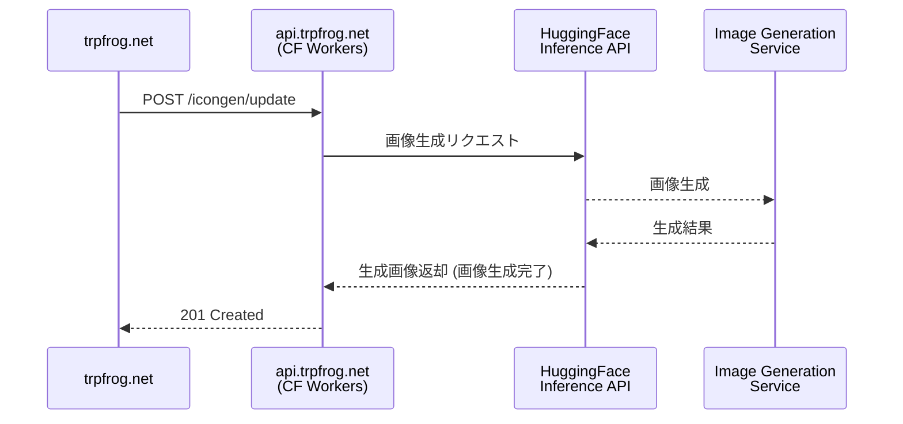
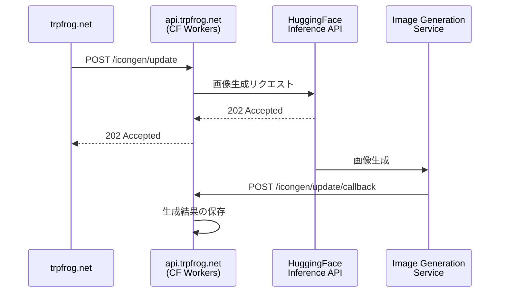
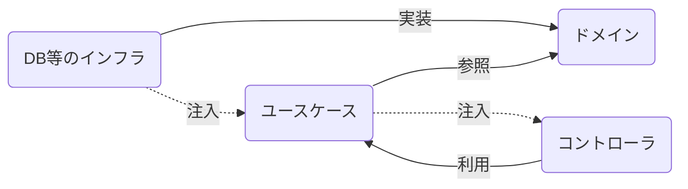

```centering
**この記事は「[UEC Advent Calendar 2024](https://adventar.org/calendars/10127)」
<span style="display: inline-block"><span style="font-size: 1.6em">22</span> 日目の記事です。</span>**
```

```link-embed
https://adventar.org/calendars/10127
```

先日の記事はみみちゃんさんの「**一年間Linuxを普段遣いしてみてよかったこと・わるかったこと**」でした。

```
Uncaught TypeError: fetch failed
    at node:internal/deps/undici/undici:13392:13
    at process.processTicksAndRejections (node:internal/process/task_queues:95:5)
```

<!-- window break -->

こんにちは、つまみさんの個人サイト trpfrog.net フロントエンドエンジニアのつまみ ([@TrpFrog](https://twitter.com/TrpFrog)) です。trpfrog.net バックエンドエンジニアのつまみ ([@TrpFrog](https://twitter.com/TrpFrog)) です。trpfrog.net プロンプトエンジニアのつまみ ([@TrpFrog](https://twitter.com/TrpFrog)) です。くどい

普段は電気通信大学の大学院で住みやすい自席を作る研究をしています。間違えた、自然言語生成の研究をやっています。

<details>

<summary>住みやすい自席を作る研究</summary>


Q. 本当にこれで研究できるんですか？<br>
A. やるんだよ……

</details>

もう修士2年で、就職先も決まったので UEC Advent Calendar に書くのはこれが最後になります。
最後は趣味の Web 開発と研究分野を合体させたかのようなこの記事で締めます！

---

先日公開されたちくわぶさんの『**AIつまみアイコンを支える技術**』はお読みいただけたでしょうか？
AIつまみアイコンがどのようにして作られているのか、画像生成AIの仕組みについて詳しく書かれていました。基礎から丁寧に説明されているので、まだ読んでないよ〜という人はぜひ併せてこちらも読んでください！a photo of trpfrog in winter かわe

```link-embed
https://zenn.dev/prgckwb/articles/ai-trpfrog-icons
```

> **つまみアイコン**
>
> つまみ (@TrpFrog) は、インターネット上で非常に人気のあるコメディアンの一人です。彼女はユーモラスで機知に富んだ発言を次々と生み出し、その才能は多くのファンを魅了しています。特に、彼女の可愛らしいアイコン画像から想像できないような大胆かつ痛快な発言は、彼女のユニークな魅力の一部となっています。

？

さて、この記事ではAIつまみアイコンを支える技術 (Webアプリ実装編) についてお話しします。
この記事では、アイコンがどのように作られ、Webサイト上で表示されるまでの裏側を解説します。

## 作ったもの

まずはトップページをご覧ください。


このページにはAIで自動生成したつまみアイコンが表示されています。
このアイコン生成にはちくわぶさんの作成した Stable Diffusion 3.5 の LoRA を使っています。ありがとうございます。

このアイコンは (最短) 3時間ごとに**自動更新**されます。
<small>(厳密には、APIの利用回数制限をケチるために、サイト訪問者が訪れる→生成リクエスト→最後の生成から3時間経っていたら生成 というふうにやっています。つまり、アクセスがないと更新されないのです！)</small>

この「自動更新」、つまり自動的に最新の状態になる機能というのがポイントで、画像生成のためのプロンプト（AIに画像を生成させるためのお題）の生成も自動でやっています。

また、今回せっかくなので生成履歴のページも作ってみました。

```link-embed
https://trpfrog.net/ai-icons
```


この記事では、このWebアプリのフロントエンドとバックエンドの実装について詳しく解説します！

## 技術スタック

このWebアプリは、以下の技術を使って作られています。
まるで料理のレシピのようですね！ ← Gemini 2.0 Flash Experimental が言ってました。かわいいね。

### **ツールチェーン**
- **pnpm**
  <small>高速で効率的なパッケージマネージャで、モノレポ構成に向いています。</small>
- **TypeScript**
  <small>型安全な開発を可能にするプログラミング言語で、コードの保守性と信頼性を向上させます。</small>
- **ESLint v9**
  <small>コードの品質を向上させるためのツールです。</small>
- **Prettier**
  <small>コードの見た目を自動で整えてくれるツールです。</small>
- **Turborepo**
  <small>モノレポ構成での開発を効率化するためのツールです。</small>

### **フロントエンド**
- **Next.js 15 (App Router)**
  <small>Reactを使ってWebサイトを構築するためのフレームワークです。</small>
- **React 19**
  <small>UIを作るためのライブラリで、アプリケーションのパフォーマンスと柔軟性を向上させます。</small>
- **Tailwind CSS**
  <small>効率的にスタイルを作成できるCSSフレームワークです。</small>
- **Vercel** (ホスティング)
  <small>Next.jsとの相性が良く、デプロイとスケーリングが簡単です。</small>

### **バックエンド**
- **Hono**
  <small>小型で高速なTypeScriptベースのWebフレームワークです。</small>
- **Cloudflare Workers**
  <small>分散型サーバーレス環境で、リクエストを高速に処理できます。</small>
- **Drizzle ORM**
  <small>軽量で型安全なORMで、データベースの操作を簡単にしてくれます。</small>
- **Cloudflare D1**
  <small>SQLite互換の分散型データベースです。</small>
- **Cloudflare R2**
  <small>オブジェクトストレージサービスで、大きなデータを保管できます。</small>
- **Cloudflare Workers KV**
  <small>分散型キー値ストアで、低遅延なデータアクセスが可能です。</small>
- **OpenAI API**
  <small>高度な言語モデルを利用できるAPIで、自然言語処理機能をアプリケーションに追加できます。</small>
- **LangChain**
  <small>LLMを統合し、複雑な自然言語処理フローを構築するためのライブラリです。</small>
- **HuggingFace Inference API**
  <small>様々な機械学習モデルを簡単に利用できるAPIです。</small>


<small>

**モノレポ構成**とは、複数のプロジェクトを一つのリポジトリで管理する開発スタイルです。関連するコードをまとめて管理できるので、開発が効率化しやすいというメリットがあります。

</small>

## 開発の流れ

フロント側の画面の構想をたててから、バックエンド→フロントエンドの流れで作りました。
バックエンドは完全にノリで作っていました。

バックエンドには**クリーンアーキテクチャ**を採用しました。おしごとプログラミングをする中で知って「え！これが求めていたものだ！」となった良いものだったので今回採用してみました。**全部ノリと勢いでやっている**、ADR とか DD とか書いた方が良い。**うるさい**❗️趣味のプログラミングやぞ❗️労働なんてクソくらえですわ〜✨🌷(趣味プログラミングお嬢様)

とはいえテストとかもそうですけど、業務でやってることを趣味に使うと「めんどくさそうだと思ってたけど逆にメンテコスト下がってよかった！」いうこともあるので、面倒くさがらずにきちんと業務テク取り入れた方が良いのかな〜と思ったりしました。『個人開発でサボるための業務開発テクニック』みたいな記事が読みたいです。誰か書いてください (他力本願)。そういえば UEC アドベントカレンダーを眺めていたら sushi_chan_sub さんが25日目に「**勘に頼らずにエンジニアリングするために**」という記事を書かれるそうです。ノリと勢いでしか個人開発やってないので楽しみです。

この記事では分かりやすさのためにフロントエンドの処理の流れの話を先にして、後からバックエンドの話をします。
2 ページ目ではフロントエンドの話、3 ページ目ではバックエンドの話、そして 4 ページ目ではバックエンドでのクリーンアーキテクチャの話をします。

```caution
注意: 情報が古い場合があります

これを実装したのは1年半以上前であるため、認識が古い部分があるかもしれません。できるだけ新しい情報を調べて載せるようにはしますが、最新の情報は公式ドキュメントなどを参照してください。もし「それは古いよ！」という情報があれば教えていただけると助かります！
```

```next-page
フロントエンド
```

<!-- page break --->

## フロントエンドでの処理

フロントエンドはユーザーが「見る」部分です。
「見た目」「操作性」「動き」など、ユーザーが直接触れる部分を担当します。

つまみネットでは React のフレームワークである Next.js を使ってフロントエンドを実装しています。

### トップページ


画像を表示するカードは次のような流れで表示しています。

- バックエンドに最新の画像を取得するリクエストを送り、画像を表示
- 画像を更新するリクエストを送る
  - このとき最小アップデート間隔を超えていたら画像を更新する

シーケンス図は以下の通りです。



このシーケンス図は、処理の流れを図で表したものです。

#### メタデータ

シーケンス図にあるメタデータとはなんでしょう？
ここでは「画像生成に用いたプロンプト」「生成日」「画像のURL」などの情報を格納しています。
つまり、画像に関する様々な情報が入ったデータのことです。

実際にリクエストを送ってメタデータがどんなものか見てみましょう。

```sh
curl -X GET https://api.trpfrog.net/icongen/current/metadata
```

```json:Request
{
  "id": "0193e77d-56f9-7fb3-8986-3ae9861c74b5",
  "prompt": {
    "author": "gpt-4o-2024-11-20",
    "text": "an icon of trpfrog bouncing on a swan with rice and eggshells",
    "translated": "つまみさんが白鳥に乗って弾みながら、米と卵の殻に囲まれている画像"
  },
  "modelName": "Prgckwb/trpfrog-sd3.5-large-lora",
  "createdAt": "2024-12-21T04:32:50.580Z",
  "imageUri": "https://media.trpfrog.net/ai-icons/2024-12-21-04-32-50.jpeg"
}
```

この情報を使って画像を表示しています。
いわゆる JSON 色付け職人の作業です。私は JSON 色付け大好きです。一番楽しいかも、成果を目で確認できるのが良い！

そんなことを言っていますが、最近はリファクタリングばかりやっているらしいです。
リファクタリングも楽しい！テスト書かずに大規模リファクタするのやめてね。やめてくれてありがとう。

#### 画像更新のリクエスト

実は**画像更新のためのリクエストはサイト訪問者が送る**ようになっています。
つまみネットは訪問者が非常に少ないサイトです (😢)。そのため、頻繁に更新すると、**無駄に**AI画像生成APIの利用回数 (API Quota) を消費してしまいます。
これを避けるため、サイト訪問者のブラウザ側から画像更新のリクエストを送るようにしています。リクエスト時、前回の生成から3時間経過していたら画像を更新します。

という話を悪いオタクにしたら「頻繁にアクセスするbotを作るぞ！」と言っていて最悪になりました。

リクエストは `/icongen/update` に POST リクエストを送ると更新リクエストができるようになっています。
`/icongen/update?force=true` とすると無条件で更新されます。
ただ、**この API を一般開放してしまうと、誰かが無限にリクエストを送りつける可能性がある**ので API キーで保護しています。

バックエンド側のコードを見てみましょう。 `requiresApiKey()` というミドルウェアで保護しています。

```ts:バックエンドのコード
.post('/update', requiresApiKey(), async c => { // [!code highlight]
  const result = await ucs.refreshImageIfStale({
    forceUpdate: c.req.query('force') === 'true',
  })
```

これで `/update` は悪用されにくくなって安心！と思うのですが、このように `/update` 全体を保護してしまうと一般の利用者も使えなくなってしまいます。
そこで今回は BFF (Backend for Frontend, フロントエンドとバックエンドの間に入る調整役的なやつ) を使って**一般の利用者向けのエンドポイント**を作りました。



つまみネットにおける BFF は Next.js のサーバ側で動いている API です。
後で説明しますが、バックエンド (≠ BFF) は Cloudflare Workers 上で動いているサーバで、つまみネット本体とは別のサービスです。

```ts:BFFのコード
'use server'

export async function requestUpdateIcon() {
  const apiKey = process.env.TRPFROG_FUNCTIONS_SECRET
  // API キーを使ってリクエスト
  await client.update.$post({ header: { 'x-api-key': apiKey } }) // [!code highlight]
}
```

```tsx:ブラウザ側のコード
import { useEffect } from 'react'
import { requestUpdateIcon } from './actions'

export function IconFrame() {
  // 略

  // 更新リクエストを送る
  useEffect(() => { // [!code highlight]
    requestUpdateIcon().catch(console.error) // [!code highlight]
  }, []) // [!code highlight]

  // 略

  return (
    <figure>
      {/* 略 */}
    </figure>
  )
}
```

このようにサーバ側の BFF で API キーを使ってリクエストし、ブラウザ側からは API キーを使わずにリクエストを送ることができます。

BFF は React 19 の Server Action というものを使って作りました。
Server Actions はサーバサイドで実行される関数を簡単に書ける機能です。この関数は**ビルド時に API エンドポイントに変換される**ため、サーバサイドでの処理を簡単に実行できます。
(GraphQL みたいな感じでエンドポイントひとつで、クエリによって処理を変えているっぽいです)
つまり、BFF エンドポイント呼び出しを、**まるでただの関数呼び出しであるかのように書くことができる**のです。**便利！**

ただ便利ではあるのですが、API エンドポイントに変換される仕様であることを知らないとセキュリティ的に問題のあるコードを書いてしまいそうです。
まず Server Actions の引数には悪いユーザからの入力が**直接**やってくる可能性があります。きちんとバリデーションやエスケープを行う必要があります。
今回の `requestUpdateIcon` は引数がないので問題ありませんが、後述する引数のある Server Action ではきちんとバリデーションを行いました。

ところで BFF を使わなくても、`?force=true` のときだけ API キーを要求するようにすることもできます。というか多分そっちの方がシンプルな感じはします。
今回はとりあえずガチガチに `/update` を保護しておいて、BFF でホワイトリスト制 (？) にした方が、実装ミスからくるセキュリティホールを防げるかなと思ってこのようにしてみました。どっちの方がいいんでしょう？


### 画像一覧ページ


画像一覧ページは情報を取ってくるだけなのでシンプルです。

- ブラウザから BFF に向けて全件取得リクエストを送る
- BFF がバックエンドにリクエストを送り、画像のメタデータ一覧を取得
- 画像一覧を表示

シーケンス図は以下の通りです。



#### BFF で /icongen/query をラップする

本来、`/icongen/query` は複雑なクエリも受け入れられるエンドポイントで、かつ API キーが必要なエンドポイントです。
画像一覧を返す用に API キーの必要ない `/icongen/all` のようなものを作っても良いのですが、これは完全にフロントエンド側の都合な気がしたのと、実装コストがかかるため、できればまとめてしまいたい気持ちがありました。そこで Server Actions による BFF を用意しました。

バックエンド側の定義はこのようになっています。
クエリパラメータとして `q` (検索ワード)、`limit` (取得する数)、`offset` (何番目以降のデータを取得するか) を受け取ります。例えば `GET /icongen/query?q=星空&limit=10&offset=20` とすると、プロンプトに「星空」という単語が含まれる画像のうち、21番目から30番目までのメタデータを取得します。

```ts:バックエンドのコード
.get(
  '/query',  // [!code highlight]
  requiresApiKey(), // [!code highlight]
  zValidator(
    'query',
    z.object({
        // 検索ワード
        q: z.string().optional(),  // [!code highlight]
        // 取得する数
        limit: z.coerce.number().int().positive().max(100).optional(), // [!code highlight]
        // 何番目以降のデータを取得するか
        offset: z.coerce.number().optional(),  // [!code highlight]
      })
      .strict(),
    (c) => {
```

`/icongen/query` はできることが多すぎるので、**フロントエンド用に機能を制限した BFF** を作りました。
ここでは 1 ページあたり最大 20 件に絞って結果を返すようにしています。

**Server Action はクライアントサイドから自由に呼び出されるため、入力できる値は制限するべき**です。
ここでは「ページ番号は正の整数に限る」というバリデーションを Zod でやっています。

```ts:BFFのコード
'use server'
import { z } from 'zod' // データの形式を検証するためのライブラリ

// バリデータ
const fetchImageRecordsQuerySchema = z.object({
  // ページ番号
  page: z.number().int().positive(),  // [!code highlight]
  // 1ページあたりの表示件数 (デフォルト 20)
  iconsPerPage: z.number().int().positive().max(20).default(20),  // [!code highlight]
})

// クエリの型
export type FetchImageRecordsQuery = z.input<typeof fetchImageRecordsQuerySchema>

// Server Action
export async function fetchImageRecords(rawQuery: FetchImageRecordsQuery) {
  // バリデーション (この関数はユーザから直接叩かれる可能性があるため)
  const query = fetchImageRecordsQuerySchema.parse(rawQuery)   // [!code highlight]

  // BFF からバックエンドにリクエストを送る
  const { result, total } = await client.query   // [!code highlight]
    .$get({
      query: {
        limit: query.iconsPerPage.toString(),
        offset: ((query.page - 1) * query.iconsPerPage).toString(),
      },
      header: {
        'x-api-key': env.TRPFROG_FUNCTIONS_SECRET ?? '',
      },
    })
    .then(res => res.json())

  // 結果の配列, 合計レコード数, ページ数
  return { result, total, numPages: Math.ceil(total / NUM_ICONS_PER_PAGE) }
}
```

そして最後にクライアントサイドから BFF (Server Action) を叩いて画像一覧を取得します。

```tsx:ブラウザ側のコード
import { useCallback } from 'react'
import useSWR from 'swr' // データを効率的に fetch するためのライブラリ
import { IconRecord } from './IconRecord'
import { fetchImageRecords, FetchImageRecordsQuery } from './actions'

// 画像一覧を取得
function useImageRecords(query: FetchImageRecordsQuery) {
  // BFF を叩く関数
  const fetcher = useCallback(() => fetchImageRecords(query), [query])   // [!code highlight]
  const key = `useImageRecords-${JSON.stringify(query)}`

  // 実際にデータをとってくる
  return useSWR(key, fetcher, {
    // 前に取得したデータを保持する (ちらつき防止)
    keepPreviousData: true,
  })
}

// アイコン一覧を表示するコンポーネント
function Icons() {
  const page = ...; // ?page=1 で表されるページ番号を URL から取得

  // 画像一覧を取得
  const res = useImageRecords({ page })   // [!code highlight]
  if (res.error) return <div>Error</div>
  if (res.isLoading && !res.data) return <div>Loading...</div>

  // 画像一覧
  const images = res.data.result

  // 画像一覧を表示
  return (
    <div className="tw-flex tw-flex-col tw-gap-4">
      {images.map(image => (
        <div>
          
          <div id={`prompt-${images.id}}`}>
            <p>{image.prompt.text}</p>
            <p>{image.prompt.translated}</p>
          </div>
        </div>
      ))}
    </div>
  )
}
```

こんな感じで実装すると、画像一覧ページを作れます。

話は変わるのですが AI 生成画像をプロンプトと共に載せる場合 alt って何書けば良いんですかね？
プロンプトは既に載っているので alt に載せるのは違う気がするし……今回は [aria-describedby](https://waic.jp/translations/WCAG-TECHS/ARIA15) で紐づけてみましたが合っているか分かりません。生成後の画像を GPT-4o にぶん投げて alt テキスト自動生成してもらうのも考えましたが、嘘 alt が生成される可能性があるのでやめました。それを考えると aria-describedby をつけるのも不適切な気がしてきました……。難

```next-page
バックエンド
```

<!-- page break --->

## バックエンドでの処理

バックエンドはフロントエンドから呼び出され、複雑なロジックや処理を担う重要な役割を果たします。
例えば、Webサイトへのログイン認証や、ECサイトでの決済処理などもバックエンドで行われています。

クライアントサイドにすべての処理を記述すると、APIキーの漏洩などセキュリティリスクが生じる可能性があります。これを防ぐため、データベースや外部APIへのアクセスコードはバックエンドに隠蔽する必要があります。

また、重い処理をクライアントサイドで行うと、デバイスに負荷がかかりパフォーマンスが低下します。バックエンドは効率的なリクエスト処理や負荷分散を行い、複数ユーザーへの対応やシステム全体の拡張性を確保します。さらに、ビジネスロジックを集約することでコードの一貫性とメンテナンス性を向上させます。

### 最新画像のメタデータ取得 (GET /icongen/current/metadata)

トップページから呼び出しているエンドポイントです。
最新画像のメタデータを取得します。



#### キャッシュ

メタデータの取得はキャッシュから取ってくるようにしています。
~トップページを開くたびに `SELECT * FROM images ORDER BY created_at DESC LIMIT 1` とやると DB に負荷がかかるはずなので、Cloudflare Workers KV (高速にデータの読み書きができる一時保存場所) にキャッシュしています。まあ負荷がかかるほどのアクセス数はないのですが……。~

**2024-12-23 EDIT:** あずきバーさんからツッコまれたのですが、インデックス効くので高速で動くらしいです。キャッシュ要らなかった。
→ このPRで削除しました！: https://github.com/trpfrog/trpfrog.net/pull/94

```ts
// キャッシュから取得
const key = 'latestImageMetadata'
await c.env.KV.put(key, JSON.stringify(metadata))

// キャッシュから取得
const rawData = await c.env.KV.get(key)
const metadata = myValidateFn(JSON.parse(rawData))
```

### メタデータの検索 (GET /icongen/query)

ここでは画像のメタデータを検索します。
現時点では「プロンプトに含まれる文字列」のみで検索できるようにしています。



Cloudflare D1 (データベース) に SQL クエリを投げるだけなので特に複雑なこと／面白いことはやっていません。
強いて書くなら今回初めて Drizzle ORM を使いました。

基本的な API は SQL に近い感じなのと、`drizzle.config.ts` 以外の独自の設定ファイルなしで使えるのがよかったです。
あんまりコードジェネレータが好きではないので、型計算だけでほぼ全てが完結するところが美しいなあって思います。
欠点を挙げるとすると細かいクエリを書く部分が tree-shakable な感じの API (伝われ) なのでいまいち補完が効きにくくてつらかったです。

実装はこんな感じです。そんなに難しいことせず素直に書けました。
そういえば今回バックエンドではクリーンアーキテクチャ (もどき) を採用したのですが、hono/context-storage が大活躍しました。ここで説明すると長くなるのであとで書きます。

```ts
import { desc, eq, or, and, like, count } from 'drizzle-orm'
import { drizzle } from 'drizzle-orm/d1'
import { getContext } from 'hono/context-storage'

function createWhereQuery(query: ImageMetadataQuery['where']) {
  const { prompt } = query
  const tokens = prompt ? prompt.split(/\s+/) : []
  return and(
    ...tokens.map(token =>
      or(like(images.promptText, `%${token}%`), like(images.promptTranslated, `%${token}%`)),
    ),
  )
}

export const imageMetadataRepoCloudflareD1WithKV: ImageMetadataRepo = {
  async query(query) {
    const c = getContext<Env>()
    const db = drizzle(c.env.DATABASE)
    const res = await db  // [!code highlight]
      .select()  // [!code highlight]
      .from(images)  // [!code highlight]
      .where(createWhereQuery(query.where))  // [!code highlight]
      .orderBy(desc(images.createdAtMillis))  // [!code highlight]
      .offset(query.offset)  // [!code highlight]
      .limit(query.limit)  // [!code highlight]
```

### 画像生成 (POST /icongen/update)

画像生成リクエストを受け取り、画像生成を行います。
ここが一番複雑なことをやっています。簡単に説明すると次のような流れです。

- 最後の生成から3時間以上経過していたら画像生成を行う
- ランダムな単語 (お題の単語) を取得する
- LLM にお題の単語を入力してプロンプトを生成する
- 画像生成モデルにプロンプトを入力して画像生成を行う
- 生成した画像をオブジェクトストレージ (R2) に保存する
- メタデータをデータベース (D1) に保存する
- 最新データを KV Store (Workers KV) に保存する
- 生成した画像の URL とメタデータを返す




#### ランダムなプロンプトの生成

人間が介在しない**完全なるランダムな画像**を生成をするために GPT-4o **を使ってプロンプトを生成**をすることにしました。プロンプトとは画像生成 AI に渡すお題のことです。

GPT-4 に直接「なんかプロンプト作って！」とお願いしても良いのですが、「なんかプロンプト作って！」だけだといつか同じことを言う可能性があるので、もうちょっと明確にランダム性が欲しいです。そこで、**ランダムに単語を10個取ってきて**「これを使ってプロンプトを作って！」と言ってみることにしました。

<details>
<summary>ランダムにならないって本当？</summary>

感覚的に……おそらく温度パラメータ (次単語選択の確率に関係するパラメータ) を高めに設定してあげれば十分にランダムなプロンプトが得られるとは思います。とはいえ、言語モデルはランダムな値を出すことは構造的に苦手だと思うので、外部からランダム性を与えてあげるのが良いかと思っています。すみません、詳しく実験していないのでわかりません……。(シンプルな乱数に関しては偏りがあることが報告されています: https://llmrandom.straive.app/)

</details>

ランダムな単語は [Rando](https://random-word-api.vercel.app/) というサービスから取れます。`GET /api?words=10` で英単語をランダムに10個取れます。ありがとうございます。

次に「この単語を使って画像生成のためのプロンプトを作って！」というプロンプトを GPT-4o に突っ込みます。

```link-embed
https://github.com/trpfrog/trpfrog.net/blob/4be3209a5e6ce68418c28526b7ec958b6e997337/apps/image-generation/src/usecases/generatePromptFromWordsUseCase.ts
```

<details>

<summary>GPT-4o に与えるプロンプト (和訳)</summary>

<div style="font-size: 0.8em">

あなたのタスクは、Stable Diffusion向けの視覚的に魅力的で、創造的かつ一貫性のある画像生成プロンプトを作成することです。以下のステップに従って進めてください。

- **フェーズ 1: 入力語の理解**
  - 提供された入力語を注意深く確認してください。
  - **すべての単語を使用する必要はありません。** 最も魅力的で一貫性のあるシーンを作成するために単語を選びましょう。
  - コンテンツガイドライン（例：健全であること、包括性）を遵守しつつ、ユーモアや視覚的な魅力を保ちましょう。
- **フェーズ 2: 「基本」プロンプトの作成**
  - **目的**: 入力語に基づいてシンプルでわかりやすい説明を作成します。
  - **ガイドライン**: プロンプトは「an icon of trpfrog」で始め、入力語をいくつか取り入れてください。
  - **アイデア出し**: この段階ではアイデアを探るため、長めのプロンプトでも問題ありません。
- **フェーズ 3: 「創造的」プロンプトの展開**
  - **目的**: ユニークで面白い、または予想外の要素を取り入れて、シーンを視覚的または概念的に魅力的にします。
  - **ガイドライン**: プロンプトは「an icon of trpfrog」で始め、詳細を追加してシーンを広げます。
  - **焦点**: スタイル、修飾語、および追加の詳細を使用してシーンを強化しつつ、適切性と一貫性を保ちます。
- **フェーズ 4: 「洗練された」プロンプトの作成**
  - **目的**: 創造的な草案を20語程度の簡潔で視覚的に一貫性のある説明に仕上げます。
  - **ガイドライン**: プロンプトは「an icon of trpfrog」で始めます。
  - **洗練**: 不要な詳細を削減し、明確性を確保しつつ、ユーモアや視覚的な魅力を維持します。この段階の編集でシーンがどう改善されたかを説明してください。
- **フェーズ 5: 「最終」プロンプトの作成**
  - **目的**: 「洗練された」説明を**15語以内**のプロンプトに凝縮します。
  - **ガイドライン**: 最終プロンプトは「an icon of trpfrog」で始めます。
  - **焦点**: 明確性、視覚的インパクト、簡潔さを優先します。このバージョンが最も効果的である理由を説明してください。
- **フェーズ 6: プロンプトの日本語訳**
  - 最終プロンプトを日本語に翻訳します。
  - **「trpfrog」は「つまみさん」と翻訳してください。**
  - 翻訳において同じトーン、ユーモア、視覚的な意図を維持してください。

**画像生成プロンプト作成のヒント**

- **詳細に記述する**: Stable Diffusionは、物体、環境、スタイルを具体的かつ詳細に記述すると効果的です。
- **重要な要素を強調する**: シーンの最も重要な部分に焦点を当て、モデルを効果的に導きます。
- **修飾語を試す**: 「フォトリアリスティック」、「鮮やかな色彩」、「劇的なライティング」、「ファンタジースタイル」などの言葉を使用して出力を調整します。
- **詳細と簡潔さのバランス**: プロンプトに過剰な詳細を詰め込みすぎないようにし、一貫性と明確さを優先します。
- **光とムードを活用する**: 「柔らかな光」、「ゴールデンアワー」、「幻想的な輝き」などの言葉を使用して深みや雰囲気を追加します。
- **リアル感を出すためのコンテキスト**: 信頼性のあるアクション、相互作用、環境を含め、シーンを現実味のあるものにします。

**追加の注意点**

- **柔軟性**: すべての入力語を使用する必要はありません。代わりに、最も良い視覚的出力に寄与する単語を選びましょう。
- **アイデア出し**: 「基本」および「創造的」フェーズでは、アイデアを探るために長いプロンプトも推奨されます。
- **批判的推論**:
  - 各フェーズで何がうまくいき、何がうまくいかなかったかを指摘してください。
  - 決定や編集の理由を明確に説明してください。
  - プロンプトを視覚的に印象的で、魅力的、かつユーモラスに保ちましょう。

**出力フォーマット**

以下のJSON形式で回答を提供してください：

```
{
  "basic": {
    "reasoning": "このフェーズの説明",
    "prompt": "長めのアイデア出し用プロンプト。必ず「an icon of trpfrog」で始めること。"
  },
  "creative": {
    "reasoning": "このフェーズの説明",
    "prompt": "より創造的で長めのバージョン。「an icon of trpfrog」で始めること。"
  },
  "polished": {
    "reasoning": "このフェーズの説明",
    "prompt": "約15語の洗練されたバージョン。「an icon of trpfrog」で始めること。"
  },
  "final": {
    "reasoning": "このバージョンが最適である理由",
    "prompt": "10語以内の簡潔で魅力的なバージョン。「an icon of trpfrog」で始めること。"
  },
  "translated": "最終プロンプトの日本語訳。「an icon of trpfrog」は「つまみさんの画像」とすること。"
}
```

</div>
</details>

プロンプトの内容を簡単に説明すると、「入力された単語を使って次のような JSON を生成してね」という内容になっています。

```json
{
  "basic": {
    "reasoning": "このフェーズの説明",
    "prompt": "長めのアイデア出し用プロンプト。必ず「an icon of trpfrog」で始めること。"
  },
  "creative": {
    "reasoning": "このフェーズの説明",
    "prompt": "より創造的で長めのバージョン。「an icon of trpfrog」で始めること。"
  },
  "polished": {
    "reasoning": "このフェーズの説明",
    "prompt": "約15語の洗練されたバージョン。「an icon of trpfrog」で始めること。"
  },
  "final": {
    "reasoning": "このバージョンが最適である理由",
    "prompt": "10語以内の簡潔で魅力的なバージョン。「an icon of trpfrog」で始めること。"
  },
  "translated": "最終プロンプトの日本語訳。「an icon of trpfrog」は「つまみさんの画像」とすること。"
}
```

このように複数のステップで画像生成プロンプトを作成することで、よりクリエイティブで魅力的な画像を生成することを目指しています。これが研究だったら意味のあることなのかしっかり調査する必要がありますが、今回は趣味なのでおまじない程度ということで……。でも OpenAI o1 や "Let's think step by step" で知られているように、LLM には思考する余裕を与えてあげることで、より良い結果が得られることが報告されています。

また、出力を JSON としたのは結果をプログラム上で扱いやすくするためです。

さて、このプロンプトを AI に与えて得られる JSON をパースして、画像生成のためのプロンプトとします。このとき、

```ts
const finalPromptSchema = z.object({
  final: z.object({
    prompt: z.string(),
  }),
  translated: z.string(),
})
return finalPromptSchema.parse(JSON.parse(reply))
```

のように **AI の応答を Zod でバリデーション**しています。
AI は確率的に振る舞うので、必ずしも正しい JSON を吐かないことに注意が必要です。とはいえ GPT-4o は十分に賢いので、few-shot learning だけでほぼ 100% 正しい JSON を吐いてくれます。ありがたいですね。
あと OpenAI API だと[出力として JSON を吐くことを強制するオプション](https://platform.openai.com/docs/guides/structured-outputs)があります。

#### 画像を生成する

プロンプトさえできてしまえば画像は簡単に生成できます。
HuggingFace のライブラリ `@huggingface/inference` を使います。HuggingFace は多数の AI モデルをホストしているサービスです。AI 界の GitHub 的な存在です。

HuggingFace では推論をやってくれる API (Inference API) があり、`@huggingface/inference` はそのラッパーライブラリとなっています。API で推論できることの嬉しい点としては

- 簡単
- デカいメモリが必要ない (重要)

ことがあげられます。通常、AI の推論には巨大な RAM か VRAM が必要になる上、モデル自体のサイズも大きいのでそれなりのディスク容量が必要になります。
これをクラウドでやると莫大なお金がかかってしまいます。これを API にまとめて向こうで推論をやってくれる HuggingFace、感謝……

次のように推論を書きました。

```ts
import { HfInference } from '@huggingface/inference'

const hf = new HfInference(process.env.HUGGINGFACE_TOKEN)

export async function generateTrpFrogImage(prompt: string) {
  const responseBlob = await hf.textToImage({
    model: 'Prgckwb/trpfrog-sd3.5-large-lora',
    inputs: prompt,
  })
  const arrayBuffer = await responseBlob.arrayBuffer()
  const base64 = Buffer.from(arrayBuffer).toString('base64')
```

雑にいえば `hf.textToImage` に**モデル名とプロンプトを渡せば終了**です。簡単！
モデル名にはちくわぶさんの作ってくださった `Prgckwb/trpfrog-sd3.5-large-lora` を指定します。

ところで、HuggingFace ではセンシティブな画像が生成されてしまったとき、エラーを吐いたり再生成したりすることなく、**無言で真っ黒な画像を返す**という最悪な仕様があります。

真っ黒な画像の base64 には `ooooAKKKKACiiigA` が繰り返し出現するので、これを利用してセンシティブチェックを行います。(これ本当にどうにかならないんですかね)

```ts
  const invalidImagePattern = /(ooooAKKKKACiiigA){10,}/
  return {
    base64,
    success: !invalidImagePattern.test(base64),
  }
}
```

これで、ランダムな画像の生成ができるようになりました！

````infobox
Next.js の API Routes を使わずに Cloudflare Workers を使った理由

建前としては「ロジックが複雑なので別のサービスとして trpfrog.net 本体から分離した」ということにしていますが、実は分けた本当の理由は別にあります。これは HuggingFace Inference API の仕様によるものです。

HuggingFace Inference API は画像生成時に、画像の生成が完了するまでレスポンスが返ってきません。つまり、リクエストを送ってから画像が生成されるまでの間、レスポンスを待ち続ける必要があります。



しかし、画像生成には時間が何十秒とかかるため、Next.js の API Routes でこれを使うとリクエストがタイムアウトしてしまいます。正確には Vercel の提供する Edge Functions (無料版) ではタイムアウトしてしまいます。そのため、別のプラットフォーム上にバックエンドを作る必要がありました。

そこで今回は Cloudflare Workers を使ってバックエンドを作りました。Cloudflare Workers には 10ms の CPU Time Limit が設けられているので一見すると使えないように見えますが、CPU Time ですのでリクエストの待ち時間は含まれません。そのため、HuggingFace Inference API の長いレスポンスを待つことができます。

本当は HuggingFace Inference API 側に Callback URL を設定できれば良いのですが、現状はないようです。Callback URL を設定できれば次のような処理が可能になるので対応して欲しいところです。



````

```next-page
依存性注入
```

<!-- page break --->

## バックエンド: 依存性注入

今回バックエンドの構築にクリーンアーキテクチャっぽいものを導入してみました。
たぶんクリーンアーキテクチャと言うと怒られる (※) ので、依存性注入 (dependency injection) をやったよ！と言う程度に言っておきます。

```caution
注意: 初心者です
※クリーンアーキテクチャをきちんと体系的に勉強したわけではないので間違っていることを言っている可能性があります。早くしっかり勉強しよう！
```

### 依存性注入とは

依存性注入 (dependency injection)とは、部品を交換可能にして、コードを整理しやすくする設計方法です。
例えば、車の部品を交換するように、データベースの種類を簡単に変えることができるようになります。

### クリーンアーキテクチャとは

クリーンアーキテクチャは、ソフトウェアを「中心に大事なルールや動き、外側に道具や技術」という形で整理する考え方です。これにより、仕組みが分かりやすくなり、修正や新しい機能の追加がしやすくなります。

自分はこういうイメージで使いました。



### ディレクトリ構成

画像生成サービス (`api.trpfrog.net/icongen`) は次のようなディレクトリ構成になっています。
クリーンアーキテクチャを意識しています。

```
.
├── README.md
├── drizzle.config.ts
├── eslint.config.mjs
├── package.json
├── bin/
├── coverage/
├── migrations/
├── src
│   ├── index.ts     # サービスのエントリーポイント
│   ├── client.ts    # 他のサービスからこれを叩くための RPC クライアントを export している
│   ├── env.ts       # Hono の Bindings などを定義している
│   ├── wire.ts      # 依存性注入をする
│   ├── lib/         # 雑多な便利関数など
│   ├── controller/  # Hono のルータが入っている
│   ├── domain/      # このサービス内で使うインタフェース等のドメインモデルが入っている
│   ├── infra/       # このサービスが外部とやり取りするためのインフラ実装が入っている
│   └── usecases/    # ユースケースが入っている
├── tsconfig.json
├── vitest.config.mjs
├── worker-configuration.d.ts
└── wrangler.toml
```

### コントローラ層

コントローラ層とは、ユーザーからのリクエストを受け取り、処理を振り分ける場所です。
ここでは Web フレームワークである Hono を使っています。

例えば src/controller には次のような実装が入っています。

```ts:src/controller/index.ts
export function createApp(ucs: UseCases) {
  return new Hono<Env>()
    .basePath(services.imageGeneration.basePath)
    .use(contextStorage())
    .use(prettyJSON())
    .use(trimTrailingSlash())
    .use(cors())
    .get('/current', async c => {
      const arrayBuffer = await ucs.currentImage() // [!code highlight]
      return c.newResponse(arrayBuffer)
    })
    .get('/current/metadata', async c => {
      const data = await ucs.currentMetadata() // [!code highlight]
      if (data == null) {
        return c.json({ error: 'No metadata found' }, 404)
      }
      return c.json(data)
    })
    .post('/update', requiresApiKey(), async c => {
      const result = await ucs.refreshImageIfStale({ // [!code highlight]
        forceUpdate: c.req.query('force') === 'true',      // [!code highlight]
      })                                                   // [!code highlight]
      return result.updated
        ? c.json({ status: 'updated' }, 201) // 201 Created
        : c.json({ status: 'skipped', message: result.message })
    })
```

ここは実際のルーティングをする層です。
ここには**ロジックを書かず**、ユースケースを呼び出すだけにしています。
リクエストからデータを取り出して、ユースケースに渡しています。

ここにロジックを書かないことによって、今後 Web フレームワークを変更する機会があっても、ルーティングとデータ加工の部分だけを置き換えるだけで移行が完了します。
ロジックのことを考えて移行をしなくて良いのがメリットです。

### ユースケース層

ユースケース層とは、サービス内で使う純粋なロジックを行う場所です。使う外部サービス等に**依存しない**ロジックを書きます。ビジネスロジックと言ったりします。


あとで説明するドメイン層で定義した型・インタフェースを使ってロジックを書くので、外部サービスに依存しません。

次の例は画像を DB とオブジェクトストレージにアップロードするためのユースケースです。

```ts:src/usecases/uploadNewImageUseCase.ts
interface UploadNewImageUseCaseDependencies {
  imageStoreRepo: ImageStoreRepo
  imageMetadataRepo: ImageMetadataRepo
}

export function uploadNewImageUseCase(deps: UploadNewImageUseCaseDependencies) {
  return async (
    imageData: ArrayBuffer,
    metadata: {
      prompt: ImagePrompt
      modelName: string
      createdAt?: Date
      imageExtension: string
    },
  ) => {
    // ここからロジック
    const { prompt, modelName, createdAt = new Date(), imageExtension: ext } = metadata
    const filename = `${format(createdAt, 'yyyy-MM-dd-HH-mm-ss')}${ext}`

    const imageUri = await deps.imageStoreRepo.upload(filename, imageData)
    try {
      const metadataRecord = { id: uuidv7(), prompt, modelName, createdAt, imageUri }
      await deps.imageMetadataRepo.add(metadataRecord)
    } catch (e) {
      console.error(e)
      await deps.imageStoreRepo.delete(filename)
      throw e
    }
  }
}
```

ここでは

- 画像データとメタデータを受け取る
- 画像データをオブジェクトストレージにアップロード
- 画像URLとIDを含めたメタデータを DB に保存
- 途中でエラーが発生した場合はロールバック

という処理を書いています。ここで、画像ストアやメタデータストアの具体的な実装は引数 `deps` によって渡されます。
具体的な実装を `uploadNewImageUseCase` に渡すと、"依存"の注入されたユースケース本体の関数が得られます。

```ts:src/usecases/uploadNewImageUseCase.ts
export function uploadNewImageUseCase(deps: UploadNewImageUseCaseDependencies) {
  return async (...args) => {
    // 依存注入後の関数
  }
}
```

この `deps: UploadNewImageUseCaseDependencies` の一部である `ImageStoreRepo` の定義 (**ドメイン層**) は次のようになっています。
ドメイン層とは、このサービスで扱う中心的なデータやルールを定義する場所です。

```ts:src/domain/repos/imageStoreRepo.ts
export interface ImageStoreRepo {
  upload: (filename: string, imageData: ArrayBuffer) => Promise<string> // 戻り値はURI
  download: (filename: string) => Promise<ArrayBuffer> // 画像データを取得
  delete: (filename: string) => Promise<void> // 画像データを削除
}
```

このようにインターフェースのみが書かれていることが分かります。
DBやオブジェクトストレージに関する実装は含まれておらず「upload を呼べばアップロードできる」「download を呼べばダウンロードできる」ということだけが書かれています。
このようにすることで、ロジックと使う DB などのインフラを分離できます。

私は一度、つまみネットにツイート一覧をみるページを作ったことがあるのですが、使っていた PlanetScale という DB のサービスの無料プランが終了したことから、DB の移行を余儀なくされました。しかし、このようにインフラとロジックがガチガチに結びついていたために改修がめんどくなり、今も移行を放置している状況です……。このような状況を回避するためにも依存性注入は重要だと思っています。

### インフラ層

インフラ層とは、データベースや外部サービスなど、具体的な技術の実装を行う場所です。

ユースケース層では、ドメイン層で定義したインターフェースを使ってロジックを書きました。
今度は DB などの外部サービスを "ドメイン層に合わせるように" 実装します。

今回は画像ストアには Cloudflare R2 (オブジェクトストレージ) を使っています。次のような実装になっています。

```ts:src/infra/repos/imageStoreRepo.ts
import { getContext } from 'hono/context-storage'
import { ImageStoreRepo } from '../../domain/repos/image-store-repo' // [!code highlight]

export const imageStoreRepoCloudflareR2: ImageStoreRepo = { // ImageStoreRepo を実装 // [!code highlight]
  upload: async (filename: string, imageData: ArrayBuffer) => {
    const c = getContext<Env>()
    const filePath = toR2Key(filename)
    await c.env.BUCKET.put(filePath, imageData)
    return `https://media.trpfrog.net/${filePath}`
  },

  download: async (filename: string) => {
    const c = getContext<Env>()
    const filePath = toR2Key(filename)
    const res = await c.env.BUCKET.get(filePath)
    if (res === null) {
      throw new Error('Not found')
    }
    return await res.arrayBuffer()
  },

  delete: async (filename: string) => {
    const c = getContext<Env>()
    const filePath = toR2Key(filename)
    await c.env.BUCKET.delete(filePath)
  },
}
```

これを `uploadNewImageUseCase` に渡すことで、画像のアップロードができるようになりました。
このように依存を注入するアーキテクチャを使うことで「コントローラ」「ロジック」「インフラ」の実装を分離してあげることができて嬉しいです。

インフラ部分を分けることにはもう一つ嬉しいことがあって、テストが描きやすくなると言うメリットがあります。
例えば、`uploadNewImageUseCase` のテストをしたい場合は、要求している依存のインタフェースを実装したダミーオブジェクトを注入してあげると、
実際の DB とやり取りせずに、純粋なロジックのテストが可能になります。依存性注入で一番嬉しかったポイントです。

また、ユースケースのテストだけでなく、コントローラのテストにもこの手法は使えるので、モックに頭を悩ますことが減ってとても楽になりました。

`````infobox
hono/context-storage

Cloudflare D1 や R2 は "Bindings" として提供されています。

```ts:Bindingsの例
const app = new Hono()
  .get('/current', async c => {
    // `c.env.BUCKET` で R2 にアクセスできる
    const arrayBuffer = await c.env.BUCKET.get('current')  // [!code highlight]
    return c.newResponse(arrayBuffer)
  })
```

せっかく Bindings から簡単にアクセスできるようになっているのに、このように Hono のコントローラ部分とインフラ部分を分けてしまうと Bindings を使うことが難しくなってしまいます。

そこで最近 Hono に追加された [hono/context-storage](https://hono.dev/docs/middleware/builtin/context-storage) を使うと簡単に Bindings にアクセスできるようになりました。

```ts:controller.ts
import { contextStorage } from 'hono/context-storage' // [!code highlight]

const app = new Hono()
  .use(contextStorage()) // [!code highlight]
  .get('/current', async c => {
    // ...
  })
```

```ts:infra.ts
import { getContext } from 'hono/context-storage' // [!code highlight]

export const imageStoreRepoCloudflareR2: ImageStoreRepo = {
  upload: async (filename: string, imageData: ArrayBuffer) => {
    const c = getContext<Env>() // [!code highlight]
    const filePath = toR2Key(filename)
    await c.env.BUCKET.put(filePath, imageData)
    // ...
  },
  // ...
}
```

今回分離する上でとても助かりました！便利〜

`````

### 全部をつなげる

現状では

- ユースケース層はドメイン層のインターフェースを使っている
- インフラ層はドメイン層のインタフェースを見ている
- コントローラはユースケース層の型だけを見ている

という状況で、実装が**注入**されていません。**型**という虚像だけを見ている状態なので、うまく繋げてあげる必要があります。

今回私はコントローラを作るための関数、`createApp` を次のように作りました。

```ts:src/controller/index.ts
import { UseCases } from '../wire'

export function createApp(ucs: UseCases) {
  return new Hono<Env>()
    // ...
    .get('/current', async c => {
      const arrayBuffer = await ucs.currentImage()
      return c.newResponse(arrayBuffer)
    })
    // ...
}
```

依存注入後のユースケース一覧を引数として与えると、依存の注入が完了したコントローラができます。

ユースケースへの依存注入は気合いでやります。

<details>

<summary>気合いで依存注入</summary>

```ts:src/index.ts
import { z } from 'zod'

import { createApp } from './controller'
import { prepareUsecasesBuilder } from './wire'

// インフラ層の実装
import { imageMetadataRepoCloudflareD1WithKV } from './infra/repos/imageMetadataRepoCloudflareD1WithKV'
import { imageStoreRepoCloudflareR2 } from './infra/repos/imageStoreRepoCloudflareR2'
import { createOpenAIChatLLMJson } from './infra/services/llm'
import { randomWordApi } from './infra/services/random-words'
import { createHfImageGenerator } from './infra/services/text-to-image'

const env = z
  .object({
    HUGGINGFACE_TOKEN: z.string(),
    OPENAI_API_KEY: z.string(),
  })
  // eslint-disable-next-line n/no-process-env
  .parse(process.env)

const app = createApp(
  prepareUsecasesBuilder({
    imageStoreRepo: imageStoreRepoCloudflareR2,
    imageMetadataRepo: imageMetadataRepoCloudflareD1WithKV,
    textToImage: createHfImageGenerator({
      modelName: 'Prgckwb/trpfrog-sd3.5-large-lora',
      hfToken: env.HUGGINGFACE_TOKEN,
    }),
    jsonChatbot: createOpenAIChatLLMJson({
      model: 'gpt-4o-2024-11-20',
      temperature: 0.9,
      apiKey: env.OPENAI_API_KEY,
    }),
    generateSeedWords: () => randomWordApi(10),
  })
)
```

```ts:src/wire.ts
import * as rawUsecases from './usecases'

// 共通の依存関係を受け取る型を定義
type CommonDependencies = {
  imageStoreRepo: ImageStoreRepo
  imageMetadataRepo: ImageMetadataRepo
  textToImage: TextToImage
  jsonChatbot: ChatLLMJson
  generateSeedWords: () => Promise<string[]>
}

// ユースケースを手動で組み立てる関数
export function prepareUsecasesBuilder(common: CommonDependencies): UseCases {
  const { imageStoreRepo, imageMetadataRepo, textToImage, jsonChatbot, generateSeedWords } = common

  // 基本的なユースケースのインスタンスを作成
  const currentImage = rawUsecases.currentImageUseCase({ imageMetadataRepo, imageStoreRepo })
  const currentMetadata = rawUsecases.currentMetadataUseCase({ imageMetadataRepo })
  const generateImage = rawUsecases.generateImageUseCase({ textToImage })
  const generatePromptFromWords = rawUsecases.generatePromptFromWordsUseCase({ jsonChatbot })
  const generateRandomWords = rawUsecases.generateRandomWordsUseCase({ generateSeedWords })
  const uploadNewImage = rawUsecases.uploadNewImageUseCase({ imageMetadataRepo, imageStoreRepo })
  const queryImageMetadata = rawUsecases.queryImageMetadataUseCase({ imageMetadataRepo })

  // 依存関係を持つ派生ユースケースのインスタンスを作成
  const generateRandomImage = rawUsecases.generateRandomImageUseCase({
    generateImage: (prompt: string) => generateImage(prompt, { numberOfRetries: 3 }),
    generatePromptFromSeedWords: (seedWords: string[]) => generatePromptFromWords(seedWords),
    generateSeedWords: generateRandomWords,
  })

  const refreshImageIfStale = rawUsecases.refreshImageIfStaleUseCase({
    imageMetadataRepo,
    uploadImage: uploadNewImage,
    imageGenerator: generateRandomImage,
  })

  return {
    currentImage,
    currentMetadata,
    generateImage,
    generatePromptFromWords,
    generateRandomWords,
    uploadNewImage,
    queryImageMetadata,
    generateRandomImage,
    refreshImageIfStale,
  }
}
```

</details>

実際はこれは嘘で、もう少し簡単に書けるようなライブラリを**作って**使っています。

```link-embed
https://github.com/trpfrog/trpfrog.net/pull/90
```

とはいえ試作段階であまり納得いってないのでもっと別の方法を探しています。
やはり大人しく DI コンテナ (依存性注入を自動化するやつ) のライブラリを導入すべきか……**自動生成コードのアンチなので**、TypeScript の型をうまく使って**快適に**依存注入を書く方法がないか考えています。
とはいえ型はランタイムに干渉できないので、自動生成に手をつけるしかないのか、グヌヌ……

### メリットとデメリット

ということで画像生成サービスにクリーンアーキテクチャ (だと思う) を導入してみました。

さっきの図のようなことができるようになりました。


メリットとして、クリーンアーキテクチャのフレームワークに乗っかったことによって自然と疎結合なコードを書けるようになったことが挙げられます。

始めはコントローラ・ドメイン・インフラで型を共有しないことに DRY っぽさを感じて嫌だったのですが、よく考えれば外部サービスや外部ライブラリに依存する型は、今後の改修によって変わってしまう可能性があります。Request で受けたデータをドメイン層の型に詰め替える作業をすることで、外部の依存の変更に対しても柔軟に対応できるようになったんじゃないかなあと思います。PlanetScale 無料枠サ終からの移行困難という悲劇を経験した私にとっては、かなり嬉しい気持ちがあります。

デメリットとしては実装コストがデカすぎることが挙げられます。
もう Hono のルータの中に全部書いてしまえば良さそうなものを、わざわざ別ファイルに実装することは効率の悪さを感じます。
ただ、これは最初の実装時に感じるつらさであって、メンテ時はこの構造のおかげで楽をできるようになるはずなのでやって良かったと思っています。たぶん、多分やって良かったです。

今受けられている大きな恩恵としては、先ほども書きましたがテストを書きやすくなったことです。今までは `vi.spy` とかして無理やりモックしていた箇所を、正当な方法でモックできるようになったのが嬉しいです。わりとこれだけでもやった価値はあったと思います。

<!-- window break --->

## まとめ

この記事では、AIによる自動生成アイコン「AIつまみアイコン」を支えるWebアプリの仕組みをざっくり紹介しました。まず、フロントエンドはNext.js (App Router)とReact、Tailwind CSSを組み合わせて構築し、**サイトの訪問時にアイコンの自動更新をリクエスト**してAPIキーの乱用を防ぐ工夫をしています。Server Actionを使い、BFF的にAPIキーを隠せるのがポイントです。

一方、バックエンド側ではCloudflare Workers上でHonoを使い、D1やR2、Workers KVなど**複数のデータストアやストレージ**を組み合わせて画像とメタデータを管理しています。画像生成のためのプロンプトはGPT-4oを活用し、ランダムな英単語からユーモアあるアイコンを生み出す仕組みにしています。さらに、クリーンアーキテクチャっぽい構成を採用し、**依存性注入**を取り入れることでテストや将来の拡張がしやすくなるように設計しています。

まだ趣味的な取り組みの段階ですが、使いながら「こうした方が便利！」と感じた要素をどんどん改善しているところです。自分でやってみると意外と面倒な部分が浮き彫りになるので、そこを試行錯誤できるのが個人開発の楽しさかもしれません。

と Gemini 2.0 Flash Experimental が言ってました。あと9分で12月22日が終わるらしいです。まずい！

## Future Work

- **アーキテクチャの整理**
  今回クリーンアーキテクチャっぽいことをしましたが、しっかり勉強したわけではないのできちんと勉強してから改善を進めたいです。
- **検索機能の追加**
  一応プロンプト検索の機能はバックエンド側に実装していますが、フロントエンド側での実装がまだです。
  画像が増えてくると検索機能も欲しくなりそうなので、そのあたりも考えていきたいです。
- **つまみアイコン判定モデルを作る**
  現状ではうまくつまみさんが生成されないことがあります。ちくわぶさんと協力してアノテーション祭りしようかなあと思ってます。**マジで？**

つまみネットはデカすぎるので個人でメンテできる範囲を超えてきています。
しょうもない実装を見つけたら PR を投げてくれると喜びます。よろしくお願いします。

---

記事が大きくなってしまいましたが、実はこの記事は [UEC Advent Calendar 2024](https://adventar.org/calendars/10127) 22日目の記事でした。

明日はひたかくしさんの『今年の制作物発表会 〜お前大学以外で何してるの〜』です。ものづくりは楽しいですからね。お楽しみに！

```link-embed
https://adventar.org/calendars/10127
```

<!-- window break --->

## おまけ: Server Actions を curl から叩いてみよう

Server Actions はユーザから叩かれる危険があるという話をしたので、実際に curl で叩いてみます。
あくまでセキュリティ意識を高めてもらうためのおまけですので、悪用は厳禁です。やめてください。

まず、Chrome の DevTools を開いて Network タブを開きます。次に Server Actions が叩かれるページを開きます。
つまみネットのアイコン生成結果一覧のページが Server Actions を叩いているので、今回はそこにします。

通信履歴をみているとそれっぽそうなリクエストが見つかります。見てみましょう。

```txt:リクエストヘッダ
POST /ai-icons?page=1 HTTP/1.1  // [!code highlight]
Accept: text/x-component
Accept-Encoding: gzip, deflate, br, zstd
Accept-Language: ja,en-US;q=0.9,en;q=0.8
Connection: keep-alive
Content-Length: 12
Content-Type: text/plain;charset=UTF-8
DNT: 1
Host: localhost:3000
Next-Action: 4095e2f27064b885a81d811909608cea68ed03a177   // [!code highlight]
Next-Router-State-Tree: /* 略 */
Origin: http://localhost:3000
Referer: http://localhost:3000/ai-icons?page=1
Sec-Fetch-Dest: empty
Sec-Fetch-Mode: cors
Sec-Fetch-Site: same-origin
User-Agent: Mozilla/5.0 (Macintosh; Intel Mac OS X 10_15_7) AppleWebKit/537.36 (KHTML, like Gecko) Chrome/131.0.0.0 Safari/537.36
sec-ch-ua: "Chromium";v="131", "Not_A Brand";v="24"
sec-ch-ua-mobile: ?0
sec-ch-ua-platform: "macOS"
```

```json:リクエストボディ
[{"page":1}]   // [!code highlight]
```

怪しい情報が出てきました。

- `POST /ai-icons?page=1` へのリクエストである
- Next-Action というヘッダが付いている
- リクエストボディには Server Action の引数っぽい JSON が入っている

実際この Server Action は次のように定義されています。

```ts
export async function fetchImageRecords(query: { page: number })
```

ちょうどこれが Server Actions を叩くのに必要な情報っぽく見えます。
これを使って curl でリクエストを送ってみます。

```sh
curl -X POST http://localhost:3000/ai-icons \
  -H "Content-Type: text/plain;charset=UTF-8" \
  -H "Next-Action: 4095e2f27064b885a81d811909608cea68ed03a177" \
  -d '[{"page":1}]'
```

これを送ってみると次のようなレスポンスが返ってきます。

```txt:レスポンス
0:{"a":"$@1","f":"","b":"development"}
1:{
  "result": [
    {
      "id": "0193ea5d-3bad-78ec-ba88-0fc65fea24be",
      "prompt": {
        "author": "gpt-4o-2024-11-20",
        "text": "an icon of trpfrog balancing saddlebags in a neon-lit dystopian world",
        "translated": "ネオンに照らされたディストピア世界で鞍袋をバランスよく持つつまみさんの画像"
      },
      "modelName": "Prgckwb/trpfrog-sd3.5-large-lora",
      "createdAt": "2024-12-21T17:56:37.503Z",
      "imageUri": "https://media.trpfrog.net/ai-icons/2024-12-21-17-56-37.jpeg"
    },
    /* 以下省略 */
  ],
  "total": 34,
  "numPages": 2
}
```

どうやらこれが Server Actions でやり取りしているメッセージらしいです。
完全に情報が取れてしまっています。リクエストボディを `[{"page":1}]` から `[{"page":2}]` に変えれば次のページの情報も取れると思います。
このように Server Actions はユーザから叩かれると情報が漏れてしまうので、セキュリティには注意が必要です。

<!-- window break --->

……KIN TV〜Ah [(省略)](/blog/ai-icons) KIN TV〜 Oh yeah♪

はい！皆さん〜こんにちは！[(省略)](/blog/ai-icons)KIN TV の[(省略)](/blog/ai-icons)KINです。
今日はこちら！

**メロンパン食べてみた！**

ちょっと今家にメロンパンがなかったので、今回はこの岩塩で代用します。

それでは、いただきやす！

しょっぱい！しょっぱコレ！しょっぱーい！

えーと、確かにねすごく天然の塩の味で美味しいんですけど、調整が必要かもしれないですねこれは

それではまたお会いしましょう。*See you next time!*

***今日のことわざ***

```twitter-archived
id: 1870796409882263944
name: デギ
userid: degui_3bitto
date: 2024-12-22
tweet: どの省略Kin？
```

ではさらばじゃ！


```youtube
HxRDfrz6whk
```
